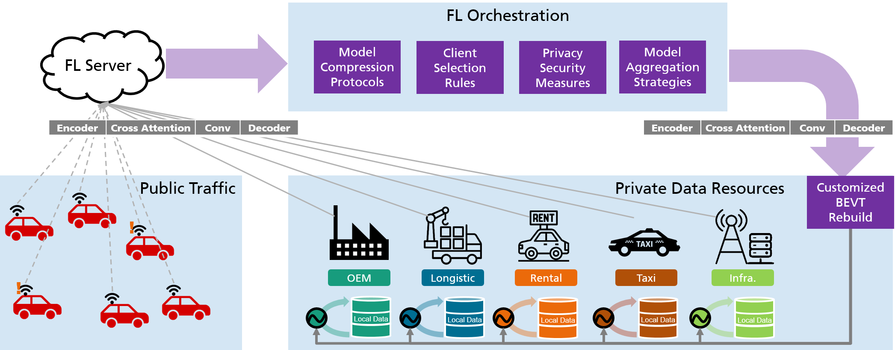

# <div align="center">**FedBEVT: Federated Learning Bird’s Eye View Perception Transformer in Road Traffic Systems**</div>

FedBEVT is a federated learning framework to train a transformer-based model for road environmental BEV perception.

<div align="center"></div>
<br>


# Installation

## List of dependencies

 - matplotlib
 - PyTorch (1.8.1)
 - numpy
 - open3d
 - opencv-python
 - tensorboardX
 - shapely
 - einops
 - cumm
 - Cython
 - timm

## Install requirements

```bash
cd fedbevt

# Initialize conda env
conda create -y --name fedbevt python=3.8
conda activate fedbevt
conda install pytorch==1.11.0 torchvision==0.12.0 cudatoolkit=11.3 -c pytorch

# Install dependencies
python fedbevt/utils/setup.py build_ext --inplace
python setup.py develop
```
# Federated Data Preparation

<div align="center"></div>
<br>

## Download

We follow the OPV2V data format, extending orignal OPV2V data (Car) with images and BEV lables for Trucks, Bus and Infrastructure: [DOWNLOAD](https://drive.google.com/drive/folders/1p3zKTaM-bzb-Ez7LRZyO-wuSUs4ws9l0?usp=drive_link).

More details on OPV2V data format can be found [HERE](https://mobility-lab.seas.ucla.edu/opv2v/).

## Preprocess

The data should be distributed to different clients according use cases. We provide the script and corresponding YAML-files for each use case.

Example for use case 1: `python3 fedbevt/tools/fed_data_utils.py --config uc1.yaml --source /data/path/to/data_resource --target /data/fedbevt/uc1`

Explanations of arguments:
- `--config`: The configuration file in YAML.
- `--source`: Source directory to original dataset.
- `--target`: Target directory to federated dataset.

# Execution FedBEVT

Example: `python fedbevt/fed/fedbevt_main.py --config fed_fax_flserver_uc1.yaml --gpu 0 --per avg`


Explanations of arguments:
- `--config`: The configuration file in YAML
- `--gpu`: The id of GPU
- `--per`: The approach used for personalization: 'avg' and 'cap' are supported


# Evaluation Procedures

Run `python fedbevt/visualization/eval_main.py -rr 'results/json_logs'` to plot the testing accuracy and training loss by the increasing number of epochs or communication rounds. 
Note that the labels in the figure is the name of result files

# Hyperparameters and Commands

We provide tables of our recommended hyperparameters and commands

## Data preparation for UC1-4
UC ID | Command 
:---: | :--- 
#1 | `python fedbevt/tools/fed_data_utils.py --config uc1.yaml --source /data/path/to/data_resource --target /data/fedbevt/uc1`
#2 | `python fedbevt/tools/fed_data_utils.py --config uc2.yaml --source /data/path/to/data_resource --target /data/fedbevt/uc2`
#3 | `python fedbevt/tools/fed_data_utils.py --config uc3.yaml --source /data/path/to/data_resource --target /data/fedbevt/uc3`
#4 | `python fedbevt/tools/fed_data_utils.py --config uc4.yaml --source /data/path/to/data_resource --target /data/fedbevt/uc4`

##  Recommended  hyperparameters

### Training parameters:

Parameter | batch size | local epoches | num of rounds | eval freq | save freq | max cav num
:---: | :---: | :---: | :---: | :---: | :---: | :---:
Value | 16 | 1 | 500 | 5 | 5 | 1 

### Optimizer parameters:

Parameter | core method | learning rate | eps | weight decay 
:---: | :---: | :---: | :---: | :---: 
Value | AdamW | 2e-4 | 1e-10 | 1e-2 

### Learning rate scheduler parameters:

Parameter | core method | warmup learning rate | warmup round | min. learning rate |
:---: | :---: | :---: | :---: | :---: 
Value | cosineannealwarm | 2e-5 | 10 | 5e-6 

## Experiment commands

### UC1:

Exp ID | `--config` |  `--per`
:---: | :---: | :---: 
#1 | fed_fax_flserver_uc1.yaml | avg
#2 | fed_fax_flserver_uc1.yaml | cap

### UC2:

Exp ID | `--config` |  `--per`
:---: | :---: | :---: 
#3 | fed_fax_flserver_uc2.yaml | avg
#4 | fed_fax_flserver_uc2.yaml | cap

### UC3:

Exp ID | `--config` |  `--per`
:---: | :---: | :---: 
#5 | fed_fax_flserver_uc3.yaml | avg
#6 | fed_fax_flserver_uc3.yaml | cap

### UC4: 

Exp ID | `--config` |  `--per`
:---: | :---: | :---: 
#7 | fed_fax_flserver_uc4.yaml | avg
#8 | fed_fax_flserver_uc4.yaml | cap

# Citation
If you find FedBEVT is useful, please cite our work:
```bibtex
@article{song2023fedbevt,
  title={FedBEVT: Federated Learning Bird's Eye View Perception Transformer in Road Traffic Systems},
  author={Song, Rui and Xu, Runsheng and Festag, Andreas and Ma, Jiaqi and Knoll, Alois},
  journal={arXiv preprint arXiv:2304.01534},
  year={2023}
}
```

# Acknowledgement
The project extensively utilizes the toolchains in the OpenCDA ecosystem, including the [OpenCOOD](https://github.com/DerrickXuNu/OpenCOOD) and the [OpenCDA](https://github.com/ucla-mobility/OpenCDA) simulation tools.
